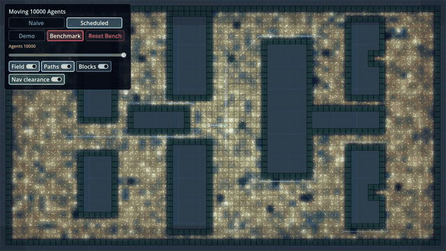

# Godot Crowd Pathfinding Benchmark

A small, deterministic Godot 4 project that measures the cost of moving many
agents to a shared goal two ways: the naive way (every agent runs
`AStarGrid2D.get_id_path()` every physics frame) and a scheduled shared-field
way (one field solve serves the whole crowd, path queries spread across frames).

It is the runnable proof behind the article
**[Moving 10,000 agents in Godot without the frame spike](https://vav-labs.com/blog/moving-10000-agents-in-godot/)**.
Clone it, open it, and reproduce the numbers yourself.

<p align="center">
  
</p>

The GIF is a visual capture of the scheduled 10,000-agent stretch. The
benchmark numbers below come from the native JSON harness output, not from the
animation.

## The result

Deterministic native benchmark, 500 moving agents on a 256×256 grid, 5 runs,
seed 1234, Godot **4.6.2-stable**. Frame budget is 16.6 ms (60 Hz physics).

| Mode | Median frame | p95 frame | Frames over budget |
| --- | --- | --- | --- |
| Naive (`get_id_path()` per agent per frame) | 670.3 ms | 4581.5 ms | 100% |
| Scheduled shared field | 2.03 ms | 6.85 ms | 0% |

The scheduled path stays inside budget as the crowd grows (native harness,
scheduled mode):

| Agents | Median frame | p95 frame | Frames over budget |
| --- | --- | --- | --- |
| 5,000 | 2.62 ms | 4.82 ms | 0% |
| 10,000 | 5.02 ms | 7.31 ms | 0% |
| 20,000 | 9.54 ms | 12.36 ms | 0.14% |

These are measurements from this scene under the conditions above, not a
product-wide claim. Your hardware, grid size, goal-relocation cadence, and
step budget will move the numbers — which is the point of shipping the harness.

## What is inside

- `scenes/main.tscn` — one scene, agents stored as data arrays (not a node per
  agent), with deterministic blockers, a shared flow-field overlay, and path
  previews.
- `scripts/shared/` — the core: `grid.gd`, `agent_set.gd`, `shared_field.gd`,
  `scheduler.gd`.
- `tools/run_benchmark.gd` / `.ps1` — the deterministic native harness. Writes
  a JSON with the frame-time distribution, over-budget percentage, query
  counts, and per-run detail.
- `tools/run_budget_sweep.ps1` — scheduled-only sweep of field step budget vs
  path latency against a frozen naive baseline.
- `tools/export_web.ps1` / `serve_web.ps1` — export and serve the Web build.

## Run it

Open the folder in **Godot 4.6.x** and run the main scene.

Controls:

- `Tab` — toggle `demo` / `benchmark`
- `Space` — toggle `naive` / `scheduled`
- `R` — reset agents
- left click in `demo` — move the shared goal

The web demo defaults to 500 agents (slider 100–1,000). The native benchmark
harness is what scales to 20,000.

Native benchmark:

```powershell
.\tools\run_benchmark.ps1
```

A larger scheduled capture, for example 5,000 agents:

```powershell
.\tools\run_benchmark.ps1 -Mode scheduled -Agents 5000 `
  -FieldBudget 768 -GoalInterval 480 -Runs 5 `
  -WarmupFrames 120 -SampleFrames 1440 `
  -OutputPath res://dist/scheduled-5000.json
```

`-Quick` runs a fast syntax/runtime validation; its output is marked
non-citable in the JSON and should not be quoted as the dataset.

## Reproducibility

The harness is seeded and deterministic: same seed, same grid, same goal
schedule → same path work. Benchmark outputs are written under `dist/` (git
ignored) so a run never silently overwrites committed numbers. The datasets
quoted in the article are published alongside it.

## Why this exists

Naive per-agent A* is the first thing everyone writes, and it is fine until the
crowd grows — then a single physics frame does thousands of full grid searches
and the frame time explodes. The scheduled shared-field approach here is one
answer. It is a technique, not a library: read it, lift it, change it.

The production problems this scene deliberately does not try to cover —
multi-size agent clearance, local grid updates, dynamic blockers, movement
ranges, tactical maps, editor workflow, and broader query scheduling — are part
of the space behind [PathForge](https://vav-labs.com/products/pathforge/), a
Godot 4 navigation-intelligence suite in development. The
[playground](https://vav-labs.com/products/pathforge/playground/) is public for
early examples and validation artifacts. This repository is not PathForge and
does not depend on it.

## Status

Reference implementation for the article above, pinned to Godot 4.6.2. It is
kept as a reproducible proof, not maintained as an evolving library — issues
and PRs are welcome but may not be actioned quickly.

## License

[MIT](LICENSE) © 2026 Vav Labs.
